<div align="center">

# Shrey Thakkar

### Product Engineer • Full Stack Developer • Building Statmize

<p>
Building software, IoT products, and AI-powered solutions that solve real-world problems.
</p>

<br>

<table>
<tr>


<td width="64%" valign="top">


</td>

<td width="36%" align="center" valign="top">


</td>
</tr>
</table>

<br>

<h3><code>shrey@github:~$ git log --contributions</code></h3>



</div>

---

# 🖥️ Terminal

```bash
shrey@github:~$ whoami

Name        : Shrey Thakkar
Role        : Product Engineer
Location    : Ahmedabad, India

Speciality  : Flutter • MERN • IoT • AI

```

---

# 🚀 Featured Projects

| Project | Description | Tech Stack |
|---------|-------------|------------|
| 🏸 **Statmize** | Smart sports analytics platform powered by IoT & AI | Flutter • BLE • Firebase |
| 🖨️ **Print Portal** | SaaS platform for printing businesses | MERN |
| 💰 **Expense Manager** | Offline-first personal finance application | Flutter • Hive |
| 🌐 **Portfolio Website** | Modern developer portfolio | Next.js |

---

# ⚡ Tech Stack

<p align="center">


</p>

---

# 📌 Currently Working On

- 🏸 Building **Statmize**
- 📱 Cross-platform Flutter applications
- 🌐 Full Stack Web Applications
- 🤖 AI-powered software
- 📡 Embedded Systems & IoT
- ⚙️ Product Engineering

---

# 📈 2026 Goals

- 📱 Publish more production apps
- 🌍 Contribute to Open Source
- ⚡ Learn Advanced System Design
- 🧠 Explore AI & Computer Vision

---

# 🌎 Let's Connect

<p align="center">

<a href="https://www.shreythakkar.dev">🌐 Portfolio</a>
&nbsp;•&nbsp;
<a href="https://github.com/shreythakkar2056">GitHub</a>
&nbsp;•&nbsp;
<a href="https://www.linkedin.com/in/shreythakkar20">LinkedIn</a>
&nbsp;•&nbsp;
<a href="mailto:shreythakkar2056@gmail.com">Email</a>

</p>

---

<div align="center">

### 💡 *Code. Build. Learn. Repeat.*

</div>