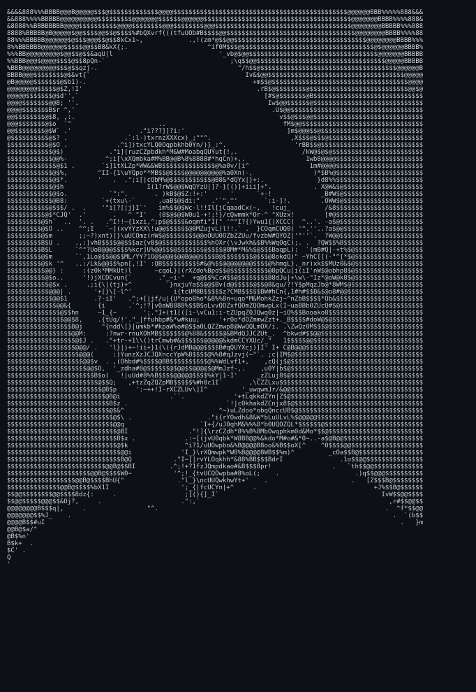

# 👋 Hi, I'm Shrey Thakkar

<i>Product Engineer • Full Stack Developer • Building Statmize</i>

 

<h3>
<code>shrey@github:~$ whoami</code>
</h3>

<table>
<tr>

<td width="38%" valign="top" align="center">

</td>

<td width="62%" valign="top">

</td>

</tr>
</table>

 

<h3>
<code>shrey@github:~$ ls projects</code>
</h3>

<table>
<tr>

<td>

🚀 **Statmize**  
Smart Sports Technology Platform

</td>

<td>

🖨️ **Print Portal**  
Cloud Printing Management

</td>

<td>

💰 **Expense Manager**  
Flutter Finance App

</td>

</tr>
</table>

 

<h3>
<code>shrey@github:~$ echo "Let's build something amazing."</code>
</h3>

